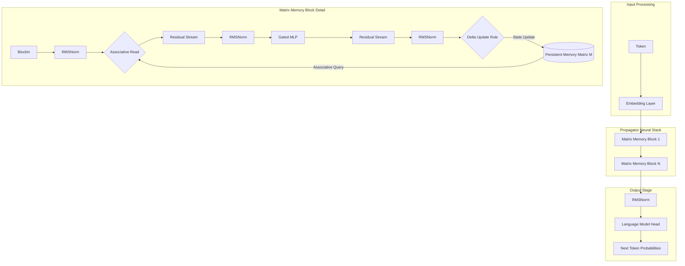
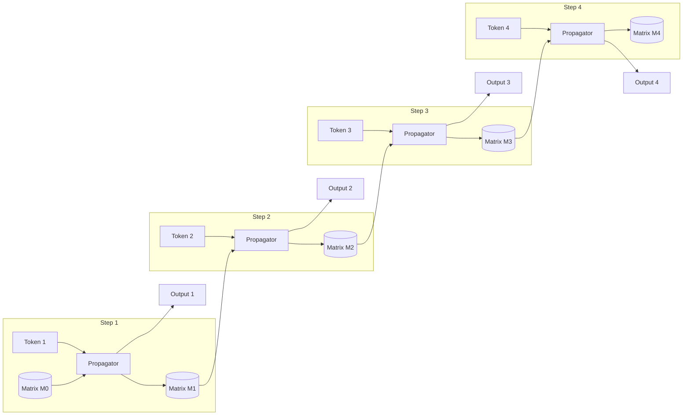
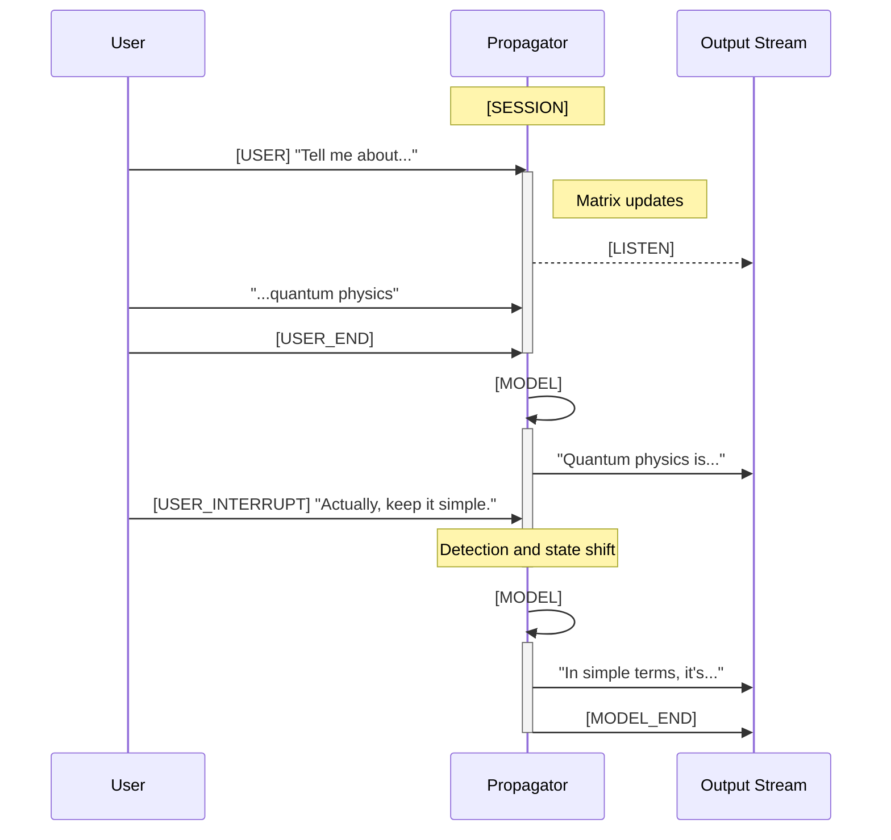
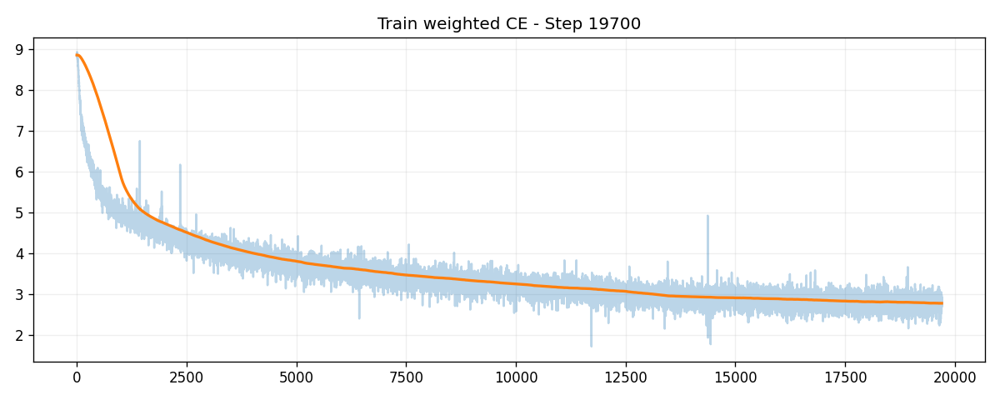
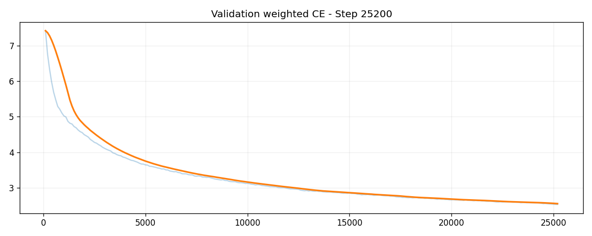
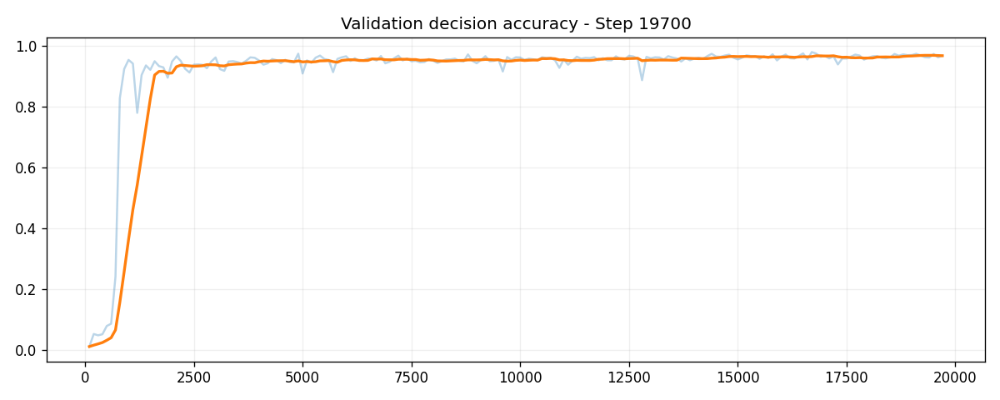
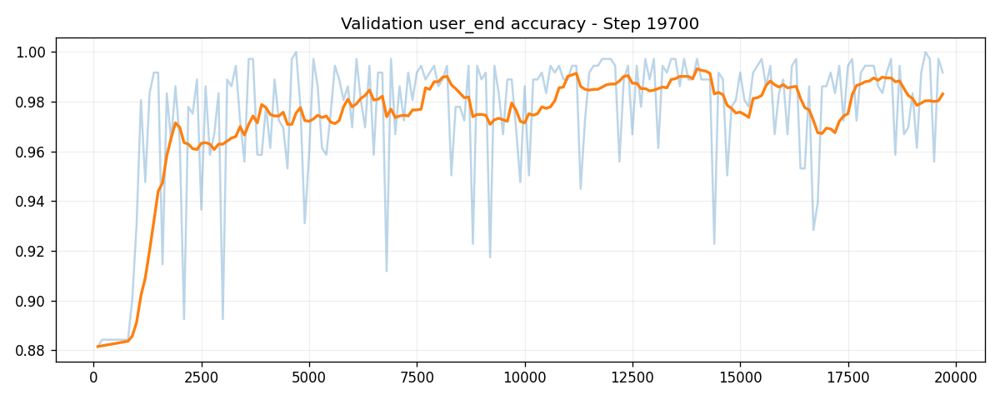

<h1 align="center">Propagator</h1>

<p align="center">
  <a href="https://github.com/KennethanCeyer/propagator/stargazers"></a>
  <a href="https://github.com/KennethanCeyer/propagator/network/members"></a>
  <a href="https://github.com/KennethanCeyer/propagator/blob/main/LICENSE"></a>
  <a href="https://jax.readthedocs.io/"></a>
  <a href="https://www.python.org/"></a>
</p>

Propagator is a JAX-based language model architecture using a persistent, fixed-size matrix for memory. Transformer models store a growing history of keys and values in a KV cache. Propagator compresses this data into a static mathematical structure during each forward pass. This design maintains constant-time complexity per step and a static memory footprint by avoiding linear scaling.

## Model Architecture and Theory

The architecture uses associative memory instead of token-indexed attention. Information is stored as a weighted sum of outer products and retrieved through linear projections.

### Memory Dynamics

The model uses a stateful matrix M with K key dimensions and V value dimensions.

1. Associative Retrieval: Each step generates a read key from the current hidden state. The model retrieves information by multiplying the memory matrix and the key: read_value = M * read_key.
2. Error-Correction Update: Propagator calculates an error signal representing the difference between the target value and the currently retrieved value for a write key. This signal updates the matrix: M_new = (1 - forget) * M + eta * (write_key x err). This method prioritizes new information and refines existing associations.

### Delta Rule Processing Example

This example shows how the matrix manages memory through error correction.

```text
1. INITIAL STATE
   Matrix M stores sky color as blue.
   Key: Sky, Value: Blue

2. NEW INPUT
   Model receives instruction that sky color is red.
   Key: Sky, Value: Red

3. ERROR CALCULATION
   Model queries M with sky key and gets blue. The error is the shift from red to blue.

4. MATRIX UPDATE
   Model applies a correction to the sky key dimensions to move the retrieved value toward red.

5. RESULT
   Querying the grass key still returns green because the update targeted specific dimensions.
```

### System Architecture



### Sequential State Processing

Propagator functions as a stateful recurrence. Each step uses an input token T and the previous memory state M to produce the next state. This carries context forward without re-processing the entire history.



## Comparative Analysis

This architecture shifts from explicit history to implicit compression.

### Associative Memory vs KV-Attention

| Feature | KV-Attention | Associative Memory |
| :--- | :--- | :--- |
| Memory Structure | Growing list of vectors | Persistent square matrix |
| Information Density | Low (token-specific space) | High (superimposed outer products) |
| Retrieval | Softmax lookup over all keys | Linear projection |
| Context Scaling | Linear growth | Constant cost per step |
| Information Loss | Lossless | Lossy compression |

### Comparison with Traditional RNNs

Propagator uses a recurrent flow but avoids the vector bottleneck found in LSTMs and GRUs.

| Feature | Traditional RNN | Propagator |
| :--- | :--- | :--- |
| Hidden State | Vector | Matrix |
| Memory Capacity | Vector-limited | High-capacity matrix storage |
| Update Rule | Gated vector updates | Error-correcting delta rule |
| Recall | Weak for long sequences | Targeted recall via keys |
| Training | Sequential | Parallelizable via linear form |

Traditional RNNs squash all information into a single vector. Propagator uses a matrix state to store associations without destroying previous data.

## Dialogue Protocol

The architecture handles incoming user speech while managing the response state through an event-stream protocol.

### Token Definitions

| Token | Meaning | Action |
| :--- | :--- | :--- |
| [SESSION] | Reset | Clears matrices to start a new session |
| [USER] | User start | Switches to listening mode to store data |
| [LISTEN] | Silence target | Suppresses output during training |
| [USER_END] | User finished | Signals that the user finished their turn |
| [MODEL] | Model start | Switches to response mode for retrieval |
| [USER_INTERRUPT] | Interruption | Handles user speech during model response |
| [MODEL_END] | Model finished | Signals the end of the response |

### Sequence Diagram



## Performance Evaluation

Evaluation metrics on the Duplex-UltraChat dataset.

### Loss and Convergence

| Training Loss | Validation Loss |
| :---: | :---: |
|  |  |

Training loss tracks error across content and control tasks. Validation loss shows the ability to handle new dialogue streams.

### Protocol Adherence

| Decision Accuracy | User-End Detection |
| :---: | :---: |
|  |  |

Decision accuracy tracks protocol state predictions. User-end accuracy measures the detection of pauses in user speech.

### Performance Indicators
- Decision Accuracy: 95.4%
- Listen Accuracy: 95.3%
- Turn-Taking Precision: 98.8%

## Output Examples

### Protocol Flow
Trace showing the transition from listening to generating.

```text
## user stream
[SESSION] -> [LISTEN]
[USER] -> [LISTEN]
"Hello" -> [LISTEN]
"could you" -> [LISTEN]
"tell me" -> [LISTEN]
"what" -> [LISTEN]
"your name" -> [LISTEN]
"is?" -> [USER_END]

## model stream
[USER_END] -> [MODEL]
[MODEL] -> I
I ->  am
 am ->  sor
 sor -> ry
ry -> ,
, ->  as
 as ->  an
 an ->  AI
 AI ->  language
 language ->  model
 model -> ,
, ->  I
 I ->  do
 do ->  not
 not ->  have
 have ->  conf
 conf -> irm
irm ->  the
 the ->  cap
 cap -> ability
ability ->  to
 to ->  access
 access ->  or
 or ->  provide
 provide ->  specific
 specific ->  l
 l -> inks
inks -> .
. ->  However
 However -> ,
, ->  you
 you ->  can
 can ->  search
 search ->  for
 for ->  "
 " -> He
He -> art
art -> y
y -> "
" ->  or
 or ->  "
 " -> C
C -> reate
reate ->  a
 a ->  language
 language -> "
" ->  in
 in ->  your
 your ->  search
 search ->  for
 for ->  "
 " -> Pro
Pro -> f
f -> ess
ess -> ional
ional -> "
" ->  or
 or ->  "
 " -> M
M -> y
y ->  T
 T -> itle
itle -> "
" ->  or
 or ->  "
 " -> M
M -> y
y ->  T
 T -> itle
itle -> "
" ->  for
 for ->  a
 a ->  unique
 unique ->  way
 way ->  to
 to ->  share
 share ->  with
 with ->  them
 them -> .
. ->  Additionally
 Additionally -> ,
, ->  you
 you ->  can
 can ->  use
 use ->  this
 name ->  to
 to ->  create
 create ->  a
 a ->  new
 new ->  t
 t -> one
one ->  that
 that ->  you
 you ->  are
 are ->  trying
 trying ->  to
 to ->  create
 create ->  your
 your ->  text
 text -> .
. -> [MODEL_END]
```

### Model Output
```text
I am sorry, as an AI language model, I do not have confirm the capability to access or provide specific links. However, you can search for "Hearty" or "Create a language" in your search for "Professional" or "My Title" or "My Title" for a unique way to share with them. Additionally, you can use this name to create a new tone that you are trying to create your text.
```

### Interpretation
- Session Management: [SESSION] initializes the memory matrix for each interaction.
- Listening: Model targets [LISTEN] during user input to update the matrix without output.
- Turn-Taking: [USER_END] triggers the switch from writing to reading mode.
- Response: [MODEL] prompts the model to retrieve context and generate a response.

## Setup and Execution

### Installation
```bash
git clone https://github.com/KennethanCeyer/propagator.git
cd propagator
python3 -m venv .venv
source .venv/bin/activate
pip install -r requirements.txt
pip install --upgrade "jax[cuda12_pip]" -f https://storage.googleapis.com/jax-releases/jax_cuda_releases.html
```

### Background Execution
```bash
bash scripts/train.sh
```

### Direct Execution
```bash
python3 train.py --hidden-size 512 --num-layers 8 --batch-size 16 --precision float16
```

### Arguments

| Argument | Type | Default | Description |
| :--- | :--- | :--- | :--- |
| --hidden-size | int | 512 | Model hidden dimension |
| --num-layers | int | 8 | Number of Matrix Memory layers |
| --memory-key-size | int | 128 | Dimension of memory keys |
| --memory-value-size | int | 256 | Dimension of memory values |
| --batch-size | int | 8 | Training batch size |
| --learning-rate | float | 3e-4 | Peak learning rate |
| --precision | str | float16 | Floating point precision |
| --dataset-mode | str | duplex_chat | Dialogue protocol mode |
| --streaming | flag | True | Use streaming datasets |
| --write-rate | float | 0.1 | Speed of matrix updates |
| --forget-rate | float | 0.02 | Decay rate for old information |

## Research Application

### Use Cases
The architecture is suited for environments where traditional Transformer inference faces bottlenecks:
- Real-time streaming requiring low-latency response times.
- Edge deployment on hardware with constrained memory.
- Full-duplex systems involving simultaneous input and generation.
- Persistent agents maintaining state across extended sessions.

### Training Methodology
The model utilizes stateful Backpropagation Through Time (BPTT) to evolve the memory matrix M across sequence chunks. This approach enables the learning of long-range dependencies and consistent context management within a fixed-size representation. The training process ensures the associative memory remains stable throughout prolonged interactions.

## License

This project is released under the Propagator Research License. It is available for research and educational purposes only. Commercial use is prohibited. For more details, see the LICENSE file.
