<h1 align="center">Propagator</h1>

<p align="center">
  
</p>

<p align="center">
  <a href="https://github.com/KennethanCeyer/propagator/stargazers"></a>
  <a href="https://github.com/KennethanCeyer/propagator/network/members"></a>
  <a href="https://github.com/KennethanCeyer/propagator/blob/main/LICENSE"></a>
  <a href="https://jax.readthedocs.io/"></a>
  <a href="https://www.python.org/"></a>
</p>

> [!NOTE]
> This repository tracks an active research implementation. Checked-in plots and evaluation assets are snapshots, not final benchmark results.

Propagator is a JAX-based streaming language and speech model architecture using a persistent, fixed-size matrix for memory. Transformer models store a growing history of keys and values in a KV cache. Propagator compresses this data into a static recurrent matrix state during each forward pass. This gives inference a constant-size memory state per layer instead of a token-length KV cache, at the cost of lossy compression.

The current experimental run is a multimodal duplex model trained on text dialogue, instruction data, image recognition, ASR rows, TTS rows, audio reconstruction, and mixed speech-dialogue supervision. It uses a byte-level BPE tokenizer with protocol tokens, Mimi audio tokens, image patch tokens, stateful chunk sampling, and weighted losses for content, control, modality, and audio-codebook targets.

## Current Snapshot

The default training configuration targets the 1B-family multimodal run. Historical plots in `assets/` are retained as comparison snapshots only.

| Item | Value |
| :--- | :--- |
| Parameters | 1,003,631,024 |
| Layers | 24 matrix-memory blocks |
| Hidden size | 1920 |
| Memory per layer | 416 keys x 832 values |
| Training unroll | 64 stream steps |
| Effective batch | 16, sharded across 8 JAX devices |
| Tokenizer | 16k byte-level BPE plus protocol/audio tokens |
| Audio codec | Mimi, 24 kHz, 8 codebooks x 2048 codes at 12.5 Hz |
| Precision | bfloat16 training |
| Optimizer | AdamW, peak LR 1e-4, 5k warmup, 0.01 weight decay |

The run is still a research prototype. Turn-taking and output-mode control are already learnable, but generated language quality is uneven and exact audio-codebook accuracy remains low.

For the 1B line, the next target is to keep validation sources fixed while scaling capacity. Distillation should come after the larger run has stable protocol behavior, using the 1B model as a teacher for a smaller edge-oriented checkpoint.

## Training Data

The current run trains from a source-aware multimodal mixture defined in `data/mixes/propagator_dataset_mix.json`. Local JSONL datasets live under `data/datasets/`; sampling plans and weights live under `data/mixes/`.

The weights below are relative sampler weights that the loader normalizes internally, not final token percentages. Packed token totals are produced by the cache/tokenization step for the exact run configuration.

| Source | Description | Type | Weight |
| :--- | :--- | :--- | ---: |
| [`data/datasets/propagator_instruction_balanced_seed.jsonl`](data/datasets/propagator_instruction_balanced_seed.jsonl) | Local constrained-format and instruction rows | Text dialogue | 0.10 |
| [`data/datasets/propagator_identity.jsonl`](data/datasets/propagator_identity.jsonl) | Small model-identity consistency set | Text dialogue | 0.02 |
| [`HuggingFaceM4/VQAv2`](https://huggingface.co/datasets/HuggingFaceM4/VQAv2) | Visual question answering | Image recognition | 0.16 |
| [`xinrongzhang2022/Duplex-UltraChat`](https://huggingface.co/datasets/xinrongzhang2022/Duplex-UltraChat) | Text dialogue and turn-taking | Text dialogue | 0.12 |
| [`databricks/databricks-dolly-15k`](https://huggingface.co/datasets/databricks/databricks-dolly-15k) | Instruction-response examples | Instruction tuning | 0.08 |
| [`HuggingFaceFW/fineweb-edu`](https://huggingface.co/datasets/HuggingFaceFW/fineweb-edu) | Educational web text | Text pretraining | 0.08 |
| [`wikimedia/wikipedia`](https://huggingface.co/datasets/wikimedia/wikipedia) | Encyclopedic text | Text pretraining | 0.03 |
| `shangeth/libritts-r-mimi-codes` | LibriTTS-R speech/text with Mimi code lanes | ASR / TTS / hybrid | 0.20 |
| `shangeth/librispeech-mimi-codes` | LibriSpeech speech/text with Mimi code lanes | ASR / TTS / hybrid | 0.11 |
| `shangeth/vctk-mimi-codes` | VCTK speech/text with Mimi code lanes | ASR / TTS / hybrid | 0.03 |
| `shangeth/jenny-mimi-codes` | Jenny speech/text with Mimi code lanes | ASR / TTS / hybrid | 0.02 |
| `shangeth/ljspeech-mimi-codes` | LJSpeech speech/text with Mimi code lanes | ASR / TTS / hybrid | 0.01 |

### Supervision Tasks

| Task | Input stream | Target stream | Purpose |
| :--- | :--- | :--- | :--- |
| Text->Text | User text or plain text | Assistant text or continuation | Dialogue, instruction following, and language modeling |
| Audio->Text | Mimi user audio tokens | Transcript text | ASR-style speech understanding |
| Text->Audio | Text prompt | Mimi assistant audio tokens | TTS-style acoustic generation |
| Audio->Audio | Mimi user audio tokens | Mimi output audio tokens | Speech reconstruction and continuation |
| Audio->Hybrid | Mimi user audio tokens | Text followed by audio tokens | Full duplex-style speech dialogue response |

Validation uses each source's validation split when one is available. For sources that only expose a training split, rows are deterministically partitioned by index so that `idx % 10 == 0` is held out for validation.

## Model Architecture and Theory

The architecture uses associative memory instead of token-indexed attention. Information is stored as a weighted sum of outer products and retrieved through linear projections.

### Memory Dynamics

The model uses a stateful matrix M with K key dimensions and V value dimensions.

1. Associative Retrieval: Each step generates a read key from the current hidden state. The model retrieves information by multiplying the memory matrix and the key: read_value = M * read_key.
2. Error-Correction Update: Propagator calculates an error signal representing the difference between the target value and the currently retrieved value for a write key. This approach is based on the Delta Rule for associative memory (Schlag et al., 2021, https://arxiv.org/abs/2102.11174). The signal updates the matrix: M_new = (1 - forget) * M + eta * (write_key x err). This method prioritizes new information and refines existing associations.

### Delta Rule Processing Example

This example shows how the matrix manages memory through error correction.

```text
1. INITIAL STATE
   Matrix M stores sky color as blue.
   Key: Sky, Value: Blue

2. NEW INPUT
   Model receives instruction that sky color is red.
   Key: Sky, Value: Red

3. ERROR CALCULATION
   Model queries M with sky key and gets blue. The error is the shift from red to blue.

4. MATRIX UPDATE
   Model applies a correction to the sky key dimensions to move the retrieved value toward red.

5. RESULT
   Querying the grass key still returns green because the update targeted specific dimensions.
```

### System Architecture

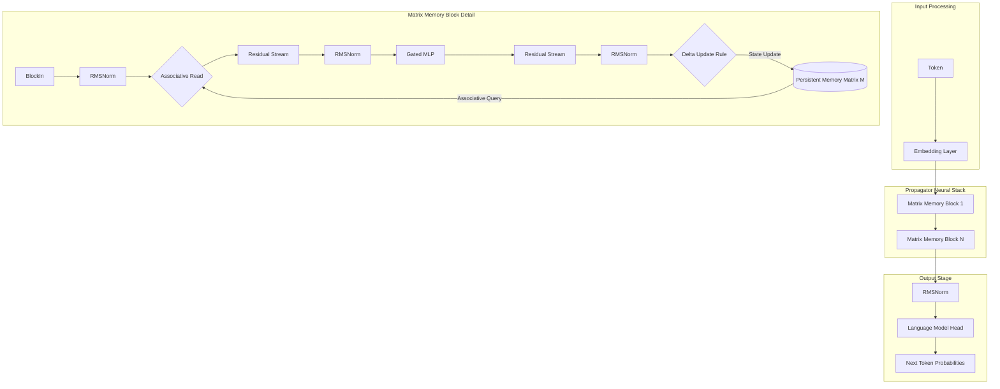
```mermaid
graph TD
    subgraph "Input Processing"
        Token --> Embed["Embedding Layer"]
    end

    subgraph "Propagator Neural Stack"
        Embed --> Layer1["Matrix Memory Block 1"]
        Layer1 --> LayerN["Matrix Memory Block N"]
    end

    subgraph "Matrix Memory Block Detail"
        BlockIn --> Norm1["RMSNorm"]
        Norm1 --> ReadLogic{"Associative Read"}
        
        Matrix[("Persistent Memory Matrix M")] -- "Associative Query" --> ReadLogic
        ReadLogic --> Resid1["Residual Stream"]
        
        Resid1 --> Norm2["RMSNorm"]
        Norm2 --> MLP["Gated MLP"]
        MLP --> Resid2["Residual Stream"]
        
        Resid2 --> Norm3["RMSNorm"]
        Norm3 --> WriteLogic{"Delta Update Rule"}
        WriteLogic -- "State Update" --> Matrix
    end

    subgraph "Output Stage"
        LayerN --> FinalNorm["RMSNorm"]
        FinalNorm --> Head["Language Model Head"]
        Head --> Prob["Next Token Probabilities"]
    end
```

### Sequential State Processing

Propagator functions as a stateful recurrence. Each step uses an input token T and the previous memory state M to produce the next state. This carries context forward without re-processing the entire history.

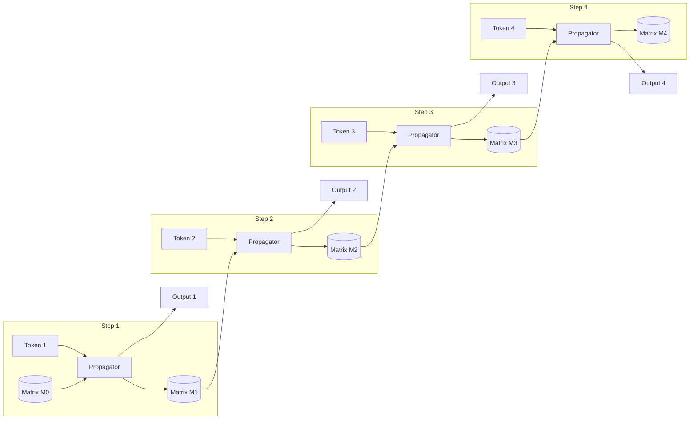
```mermaid
graph LR
    subgraph "Step 1"
        T1["Token 1"] & M0[("Matrix M0")] --> P1["Propagator"]
        P1 --> M1[("Matrix M1")]
    end
    subgraph "Step 2"
        T2["Token 2"] & M1 --> P2["Propagator"]
        P2 --> M2[("Matrix M2")]
    end
    subgraph "Step 3"
        T3["Token 3"] & M2 --> P3["Propagator"]
        P3 --> M3[("Matrix M3")]
    end
    subgraph "Step 4"
        T4["Token 4"] & M3 --> P4["Propagator"]
        P4 --> M4[("Matrix M4")]
    end
    
    P1 --> O1["Output 1"]
    P2 --> O2["Output 2"]
    P3 --> O3["Output 3"]
    P4 --> O4["Output 4"]
```

## Comparative Analysis

This architecture shifts from explicit history to implicit compression. It builds upon foundational concepts in recurrent sequence modeling (Cho et al., 2014, https://arxiv.org/abs/1406.1078) and more recent developments linking Transformers to RNNs via linear attention (Katharopoulos et al., 2020, https://arxiv.org/abs/2006.16236).

### Associative Memory vs KV-Attention

| Feature | KV-Attention | Associative Memory |
| :--- | :--- | :--- |
| Memory Structure | Growing list of vectors | Persistent fixed-size matrix |
| Information Density | Low (token-specific space) | High (superimposed outer products) |
| Retrieval | Softmax lookup over all keys | Linear projection |
| Context Scaling | Linear growth | Constant cost per step |
| Information Loss | Lossless | Lossy compression |

### Comparison with Traditional RNNs

Propagator uses a recurrent flow but avoids the vector bottleneck found in LSTMs and GRUs.

| Feature | Traditional RNN | Propagator |
| :--- | :--- | :--- |
| Hidden State | Vector | Matrix |
| Memory Capacity | Vector-limited | High-capacity matrix storage |
| Update Rule | Gated vector updates | Error-correcting delta rule |
| Recall | Weak for long sequences | Targeted recall via keys |
| Training | Sequential | Stateful truncated BPTT over stream chunks |

Traditional RNNs squash all information into a single vector. Propagator uses a matrix state to store associations without destroying previous data.

## Dialogue Protocol

The architecture handles incoming user speech while managing the response state through an event-stream protocol.

### Token Definitions

| Token | Meaning | Action |
| :--- | :--- | :--- |
| [SESSION] | Reset | Clears matrices to start a new session |
| [USER] | User start | Switches to listening mode to store data |
| [LISTEN] | Silence target | Suppresses output during training |
| [SILENCE] | Explicit silence input | Represents a silent user chunk |
| [USER_END] | User finished | Signals that the user finished their turn |
| [MODEL] | Model start | Switches to response mode for retrieval |
| [USER_INTERRUPT] | Interruption | Handles user speech during model response |
| [MODEL_END] | Model finished | Signals the end of the response |
| [TEXT_INPUT] | Text input segment | Marks text supplied by the user |
| [AUDIO_INPUT] | Audio input segment | Marks codec-token audio supplied by the user |
| [IMAGE_INPUT] | Image input segment | Marks visual tokens supplied by the user |
| [TEXT_OUTPUT] | Text output segment | Declares that the next response segment is text |
| [AUDIO_OUTPUT] | Audio output segment | Declares that the next response segment is audio codec tokens |

The multimodal training protocol covers Text->Text, Audio->Text, Image->Text, Text->Audio, Audio->Audio, and sequential mixed-output supervision. Mixed-output rows are represented as ordered output segments, for example `[TEXT_OUTPUT]` followed by text content and then `[AUDIO_OUTPUT]` followed by audio codec frames. There is no separate hybrid token; output composition is expressed by segment order.

### Sequence Diagram

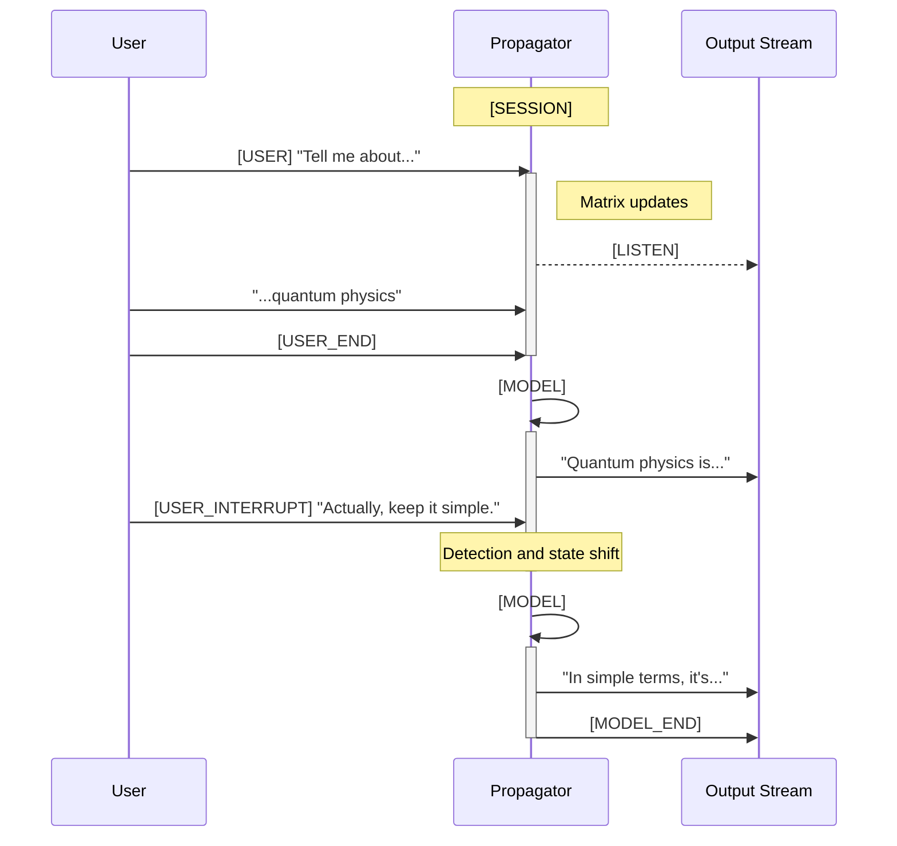
```mermaid
sequenceDiagram
    participant U as User
    participant M as Propagator
    participant O as Output Stream

    Note over M: [SESSION]
    
    U->>M: [USER] "Tell me about..."
    activate M
    Note right of M: Matrix updates
    M-->>O: [LISTEN]
    U->>M: "...quantum physics"
    U->>M: [USER_END]
    deactivate M
    
    M->>M: [MODEL]
    activate M
    M->>O: "Quantum physics is..."
    
    U->>M: [USER_INTERRUPT] "Actually, keep it simple."
    Note over M: Detection and state shift
    deactivate M
    
    M->>M: [MODEL]
    activate M
    M->>O: "In simple terms, it's..."
    M->>O: [MODEL_END]
    deactivate M
```

## Performance Evaluation

Evaluation currently uses a held-out validation stream built from each source's validation split when available. For sources that only expose a train split, rows are partitioned with `idx % 10 == 0` for validation.

The reported CE is a weighted multimodal objective, not a plain text perplexity. It includes text/content targets, turn-taking/control targets, output modality tokens, audio tokens, and auxiliary audio-codebook losses. Training loss is logged from the current training batch, while validation loss is averaged over 16 validation batches.

### Loss and Convergence

| Training Weighted CE | Validation Weighted CE |
| :---: | :---: |
| 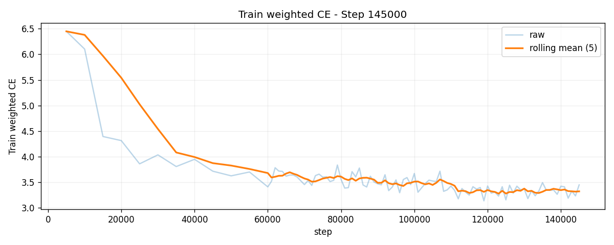 | 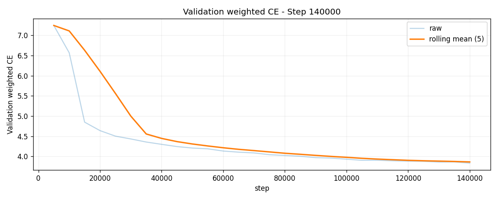 |

Archived 586M-run eval retained for comparison, completed at step 1,000,000:

| Metric | Value |
| :--- | ---: |
| Train weighted CE | 2.65 |
| Validation weighted CE | 2.31 |
| Validation composite score | 0.683 |
| Decision accuracy | 96.96% |
| Listen accuracy | 96.92% |
| User-end accuracy | 97.35% |
| Model-end accuracy | 77.79% |
| Text token accuracy | 71.27% |
| Audio token accuracy | 47.99% |
| Audio codebook exact accuracy | 0.80% |
| Audio auxiliary token accuracy | 12.38% |
| ASR task accuracy | 74.51% |
| Duplex task accuracy | 50.73% |
| Image task accuracy | 69.64% |
| Image task CE | 0.260 |

### Protocol and Modality

| Decision Accuracy | User-End Detection |
| :---: | :---: |
| 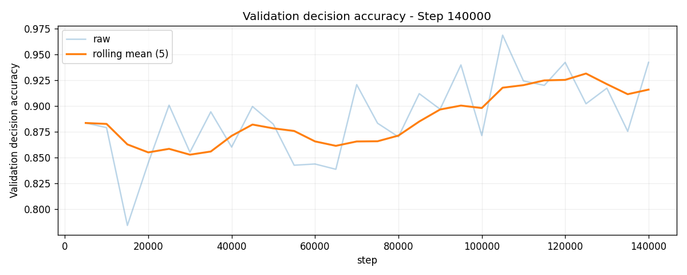 | 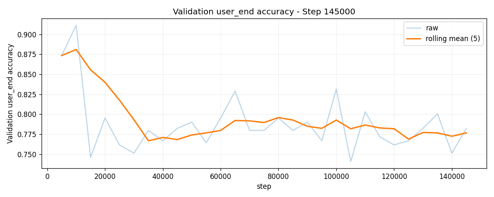 |

| Text Token Accuracy | Audio Token Accuracy |
| :---: | :---: |
| 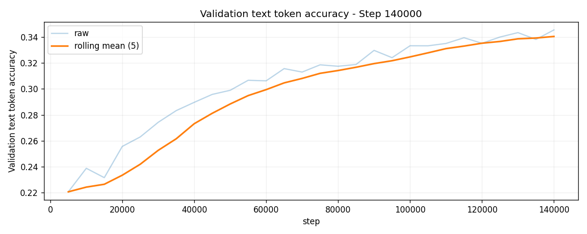 | 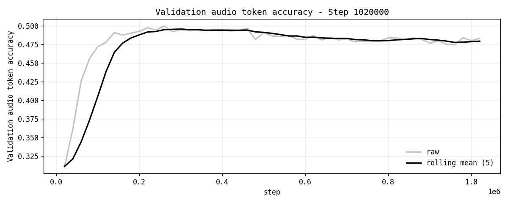 |

| ASR Task Accuracy | TTS Task Accuracy |
| :---: | :---: |
| 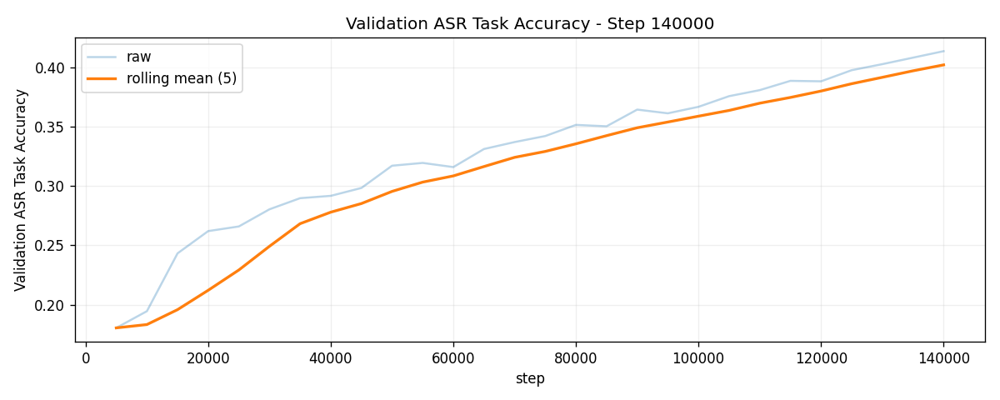 | 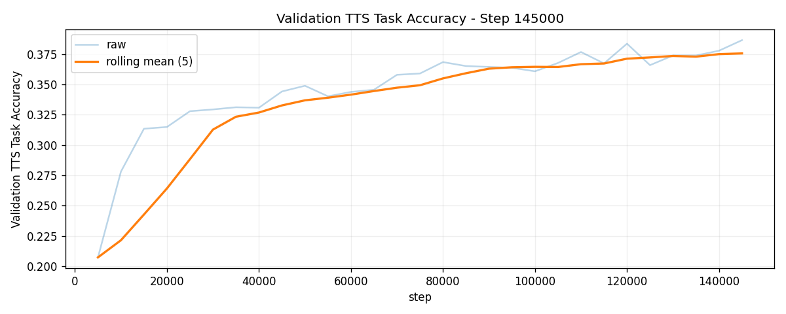 |

| Duplex Task Accuracy | Audio Codebook Exact Accuracy |
| :---: | :---: |
| 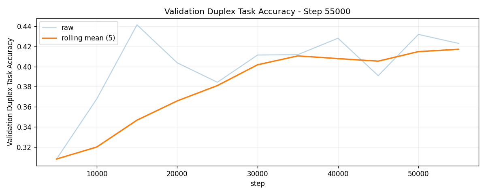 | 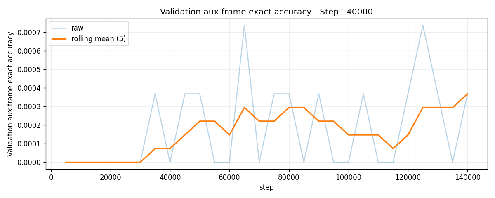 |

| Composite Score | Image Task Accuracy |
| :---: | :---: |
| 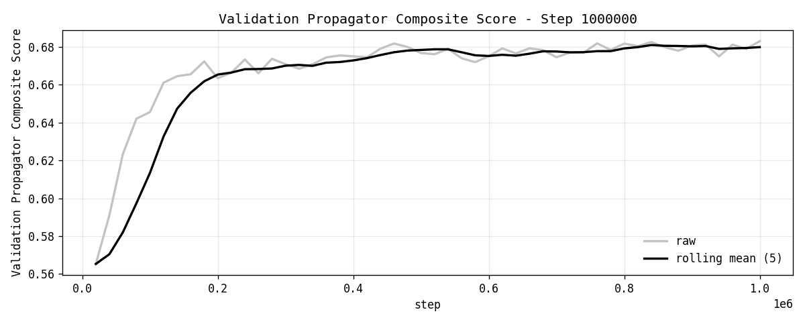 | 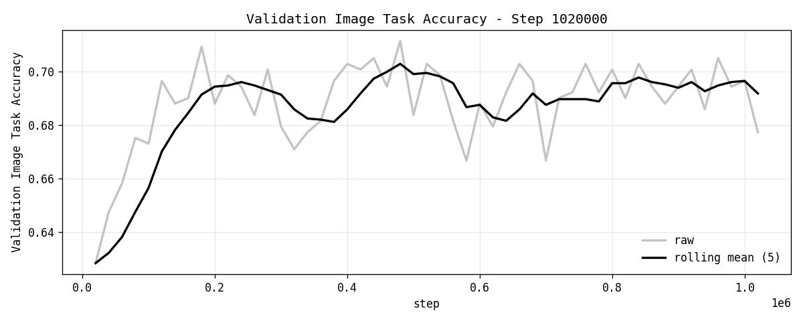 |

Validation metrics are teacher-forced measurements on held-out dataset pairs. Free-running probes are not used as evaluation results.

## Validation Artifacts

- Session management: `[SESSION]` initializes the memory matrix for each interaction.
- Listening: the model targets `[LISTEN]` during user input to update the matrix without output.
- Turn-taking: `[USER_END]` triggers the switch from writing/listening to response mode.
- Response mode: `[MODEL]` is followed by an ordered output segment such as `[TEXT_OUTPUT]` or `[AUDIO_OUTPUT]`. Image rows are evaluated as visual input followed by text output.
- Current limitation: control tokens are learning faster than high-quality long-form generation.

Fixed validation rows and archived generated samples are stored under `assets/` for inspection. They are diagnostic artifacts, not product demos.

## Setup and Execution

### Installation
```bash
git clone https://github.com/KennethanCeyer/propagator.git
cd propagator
python3 -m venv .venv
source .venv/bin/activate
pip install -r requirements.txt
pip install --upgrade "jax[cuda12_pip]" -f https://storage.googleapis.com/jax-releases/jax_cuda_releases.html
```

For TPU runs, transparent hugepages must be enabled before importing JAX/libtpu:

```bash
sudo sh -c 'echo always > /sys/kernel/mm/transparent_hugepage/enabled'
```

`scripts/train.sh` performs this check automatically and exits if it cannot enable the setting.

### Background Training
```bash
bash scripts/train.sh
```

The training script starts a detached process, writes the PID to `logs/train.pid`, and updates `logs/train.latest.log`.

```bash
tail -f logs/train.latest.log
```

Run in the foreground:

```bash
bash scripts/train.sh --foreground
```

### Current Training Defaults

The checked-in script configures the active multimodal run:

| Setting | Default |
| :--- | :--- |
| Model | 24 layers, hidden 1920, memory 416 x 832, 1,003,631,024 parameters |
| Recurrent memory upgrades | 4 grouped associative key lanes, RoPE-style stream-position key rotation, SwiGLU MLP; optional MoE experts |
| Batch | 2 examples per device, global batch 16 across 8 JAX devices |
| Epochs | 1 full pass over the uncapped tokenized training set |
| Precision | bfloat16 |
| Optimizer | AdamW with grad clipping |
| Output root | `outputs/propagator-multimodal_1b`; `_1b` is a parameter-size family suffix, not a version tag. The launch script refuses smaller presets in this root. |
| Training cap | Full uncapped tokenization/training on each training partition by default: max train/val chunks, max steps, data packs, audio duration limits, early stopping, tokenizer row limits, and per-dataset `max_chunks`/`max_shards`/`debug_max_rows` are disabled and fail fast if enabled |
| Validation holdout | Same-split sources keep a deterministic 9:1 train/validation partition with `SAME_SPLIT_VALIDATION_STRIDE=10`; the 90% training partition is trained uncapped |
| Tokenizer | 16k byte-level BPE by default; SL2610 preset trains/uses a 32k target when `TOKENIZER_VOCAB_SIZE` is not overridden |
| Audio | Mimi, 24 kHz, 8 synchronized codebooks x 2048 codes at 12.5 Hz |
| Eval cadence | every 20,000 steps |
| Checkpoint cadence | every 50,000 steps |
| GCS cadence | every 50,000 steps when `GCS_BACKUP_DIR` is set |

Most settings can be overridden through environment variables before launching. Use small dimensions only for smoke tests or explicitly named compact runs:

```bash
HIDDEN_SIZE=768 NUM_LAYERS=12 BATCH_SIZE=16 bash scripts/train.sh --foreground
```

Use `OUTPUT_ROOT=...` when launching if a run intentionally targets a different parameter-size family; keep the suffix descriptive, for example `_1b`, rather than using version labels.

For the active 1B-family teacher run, keep `MODEL_PRESET=full`; the launch script refuses compact presets such as `sl2610` when the output root contains `_1b`.

Use the 1B run as the teacher line first. Once its validation and probe outputs are steadier, distill into the SL2610-style student from teacher traces, modality choices, and final answers instead of trying to make the compact run carry the research result too early.

### Post-Training / SL2610 2GB Preset

The repository includes a cleaned README-aligned English-only post-training set at `data/datasets/propagator_posttrain_cleaned.jsonl` and a mix file at `data/mixes/propagator_posttrain_mix.json`. The rows focus on Propagator identity, recurrent matrix memory behavior, turn-taking, recall, edge serving, quantization, and the architecture changes above.

Run a compact architecture intended for 4-bit edge serving experiments, not for the 1B teacher run:

```bash
POST_TRAIN=1 MODEL_PRESET=sl2610 bash scripts/train.sh
```

Run the same preset in the foreground:

```bash
POST_TRAIN=1 MODEL_PRESET=sl2610 bash scripts/train.sh --foreground
```

The SL2610 preset sets hidden size 768, 16 layers, 192 x 384 memory, grouped associative memory, SwiGLU, one MoE expert with top-1 routing, a 32k tokenizer target, and 4-bit edge reporting. The training hardware and serving target are intentionally separate: training can run on TPU/GPU infrastructure, while the architecture and edge report budget for batch-1 SL2610 2GB VRAM serving.

## Research Application

### Use Cases
The architecture is suited for environments where traditional Transformer inference faces bottlenecks:
- Real-time streaming requiring low-latency response times.
- Edge deployment on hardware with constrained memory.
- Full-duplex systems involving simultaneous input and generation.
- Persistent streaming applications maintaining state across extended sessions.

### Training Methodology
The model uses stateful truncated Backpropagation Through Time (BPTT) to evolve the memory matrix M across sequence chunks. This lets the model learn streaming dependencies while preserving a fixed-size recurrent state. Stability and recall quality are active research questions because the matrix is a compressed, lossy memory rather than a lossless transcript.

## License

This project is released under the Propagator Research License. It is available for research and educational purposes only. Commercial use is prohibited. For more details, see the [LICENSE](./LICENSE) file.
