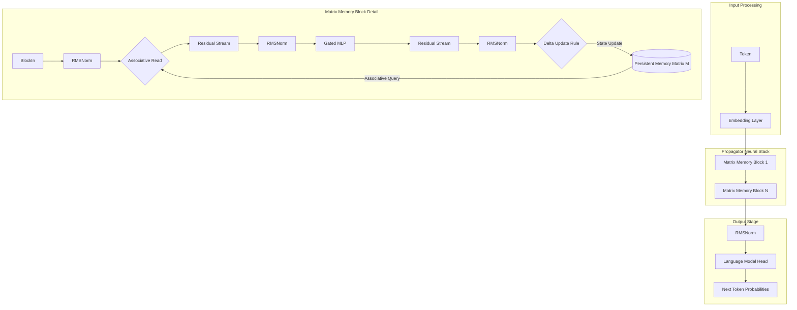
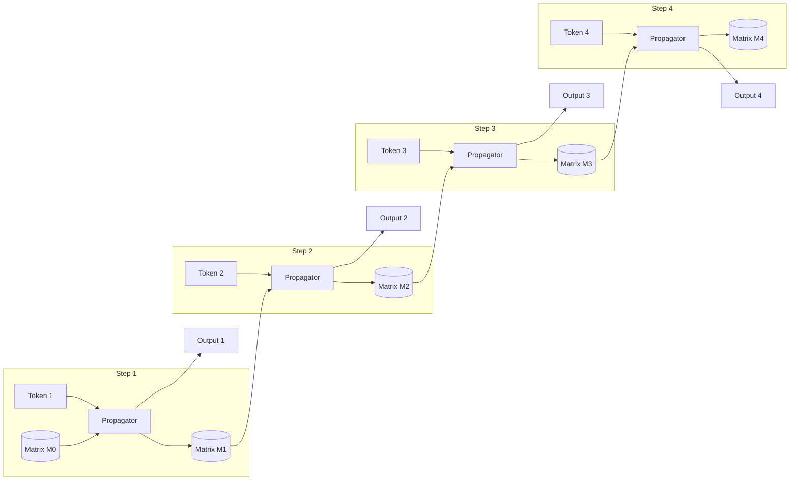
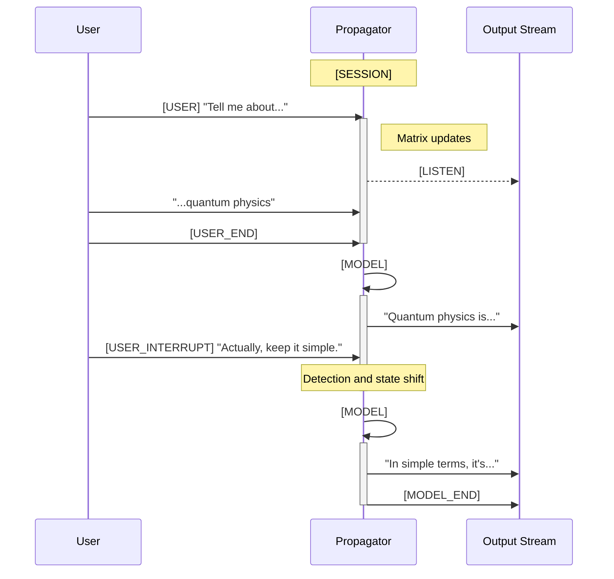

<h1 align="center">Propagator</h1>

<p align="center">
  
</p>

<p align="center">
  <a href="https://github.com/KennethanCeyer/propagator/stargazers"></a>
  <a href="https://github.com/KennethanCeyer/propagator/network/members"></a>
  <a href="https://github.com/KennethanCeyer/propagator/blob/main/LICENSE"></a>
  <a href="https://jax.readthedocs.io/"></a>
  <a href="https://www.python.org/"></a>
</p>

> [!NOTE]
> This project documents an active research run. Training is still in progress, so the final evaluation results, examples, and demos may change and will be updated after training completes.

Propagator is a JAX-based streaming language and speech model architecture using a persistent, fixed-size matrix for memory. Transformer models store a growing history of keys and values in a KV cache. Propagator compresses this data into a static recurrent matrix state during each forward pass. This gives inference a constant-size memory state per layer instead of a token-length KV cache, at the cost of lossy compression.

The current experimental run is a multimodal duplex model trained on text dialogue, instruction data, ASR rows, TTS rows, audio reconstruction, and hybrid speech-dialogue supervision. It uses a byte-level BPE tokenizer with protocol tokens, EnCodec audio tokens, stateful chunk sampling, and weighted losses for content, control, modality, and audio-codebook targets.

## Current Snapshot

Latest completed evaluation: step 55,000 from `outputs/propagator-multimodal-v2`.

| Item | Value |
| :--- | :--- |
| Parameters | 586.5M |
| Layers | 24 matrix-memory blocks |
| Hidden size | 1536 |
| Memory per layer | 384 keys x 768 values |
| Training unroll | 32 stream steps |
| Effective batch | 64, sharded across 4 JAX devices |
| Tokenizer | 16k byte-level BPE plus protocol/audio tokens |
| Audio codec | EnCodec, 24 kHz, 8 codebooks x 1024 codes |
| Precision | bfloat16 training |
| Optimizer | AdamW, peak LR 3e-4 |

The run is still a research prototype. Turn-taking and output-mode control are already learnable, but generated language quality is uneven and exact audio-codebook accuracy remains low.

## Training Data

The current run trains from a source-aware multimodal mixture defined in `data/propagator_dataset_mix_v3.json`. The mix combines public text, instruction, dialogue, ASR, TTS, and paired speech-dialogue datasets with a small local identity set for model-name consistency.

The weights below are sampling weights used by the training pipeline, not exact final token percentages. Audio rows are converted into EnCodec token streams, then packed into the same event protocol as text rows.

| Source | Role in training | Mode | Weight |
| :--- | :--- | :--- | ---: |
| [`KurtDu/EchoX-Dialogues-Plus`](https://huggingface.co/datasets/KurtDu/EchoX-Dialogues-Plus) (`S2S-QA/AudioQA`) | Paired user speech, assistant text, and assistant speech for hybrid speech-dialogue responses | `echox_s2s_dialogue` | 0.18 |
| [`HuggingFaceFW/fineweb-edu`](https://huggingface.co/datasets/HuggingFaceFW/fineweb-edu) | General text continuation and language modeling coverage | `plain_text` | 0.15 |
| [`xinrongzhang2022/Duplex-UltraChat`](https://huggingface.co/datasets/xinrongzhang2022/Duplex-UltraChat) | Text dialogue, turn-taking, idle listening, and interruption-style protocol behavior | `duplex_chat` | 0.10 |
| [`blabble-io/libritts_r`](https://huggingface.co/datasets/blabble-io/libritts_r) | Clean read-speech data weighted mostly toward text-to-audio generation | `audio_asr` | 0.08 |
| [`facebook/voxpopuli`](https://huggingface.co/datasets/facebook/voxpopuli) | Real speech recognition and speech understanding coverage | `audio_asr` | 0.07 |
| [`openslr/librispeech_asr`](https://huggingface.co/datasets/openslr/librispeech_asr) (`train.clean.360`) | ASR-heavy speech supervision with some TTS targets | `audio_asr` | 0.06 |
| [`openslr/librispeech_asr`](https://huggingface.co/datasets/openslr/librispeech_asr) (`train.other.500`) | Noisier ASR-heavy speech supervision | `audio_asr` | 0.06 |
| [`edinburghcstr/ami`](https://huggingface.co/datasets/edinburghcstr/ami) | Meeting speech and conversational ASR supervision | `audio_asr` | 0.06 |
| [`distil-whisper/librispeech_asr`](https://huggingface.co/datasets/distil-whisper/librispeech_asr) | Additional LibriSpeech-derived ASR/TTS coverage | `audio_asr` | 0.06 |
| [`wikimedia/wikipedia`](https://huggingface.co/datasets/wikimedia/wikipedia) | Factual and encyclopedic text continuation | `plain_text` | 0.05 |
| [`google/fleurs`](https://huggingface.co/datasets/google/fleurs) (`en_us`) | Multispeaker English ASR/TTS coverage | `audio_asr` | 0.04 |
| [`data/propagator_identity.jsonl`](data/propagator_identity.jsonl) | Local identity and self-description examples, repeated to remain visible in the mix | `duplex_chat` | 0.04 |
| [`databricks/databricks-dolly-15k`](https://huggingface.co/datasets/databricks/databricks-dolly-15k) | Instruction following and direct response formatting | `dolly_instruction` | 0.03 |
| [`PolyAI/minds14`](https://huggingface.co/datasets/PolyAI/minds14) (`en-US`) | Short intent-style spoken utterances | `audio_asr` | 0.02 |

### Current Tokenized Size Snapshot

The numbers below describe the current local preprocessing cache for the active run. A "protocol position" is one stream step in the packed training sequence; each chunk contains 32 protocol positions. Audio examples can also carry up to eight EnCodec codebook lanes per position, so these counts are not directly comparable to text-only tokenizer counts.

Current materialized total: 24,190,247 chunks, or 774,087,904 protocol positions. This total will increase as the remaining audio sources finish preprocessing.

| Source | Source rows | Cached chunks | Protocol positions | Status |
| :--- | ---: | ---: | ---: | :--- |
| [`KurtDu/EchoX-Dialogues-Plus`](https://huggingface.co/datasets/KurtDu/EchoX-Dialogues-Plus) | 177,354 | 3,891,296 | 124,521,472 | Materialized |
| [`HuggingFaceFW/fineweb-edu`](https://huggingface.co/datasets/HuggingFaceFW/fineweb-edu) | 312,320 | 8,915,405 | 285,292,960 | Materialized |
| [`xinrongzhang2022/Duplex-UltraChat`](https://huggingface.co/datasets/xinrongzhang2022/Duplex-UltraChat) | 148,016 | 7,587,138 | 242,788,416 | Materialized |
| [`blabble-io/libritts_r`](https://huggingface.co/datasets/blabble-io/libritts_r) | Pending | Pending | Pending | Pending preprocessing |
| [`facebook/voxpopuli`](https://huggingface.co/datasets/facebook/voxpopuli) | Pending | Pending | Pending | Pending preprocessing |
| [`openslr/librispeech_asr`](https://huggingface.co/datasets/openslr/librispeech_asr) (`train.clean.360`) | 48,640 | 580,647 | 18,580,704 | In progress |
| [`openslr/librispeech_asr`](https://huggingface.co/datasets/openslr/librispeech_asr) (`train.other.500`) | Pending | Pending | Pending | Pending preprocessing |
| [`edinburghcstr/ami`](https://huggingface.co/datasets/edinburghcstr/ami) | Pending | Pending | Pending | Pending preprocessing |
| [`distil-whisper/librispeech_asr`](https://huggingface.co/datasets/distil-whisper/librispeech_asr) | Pending | Pending | Pending | Pending preprocessing |
| [`wikimedia/wikipedia`](https://huggingface.co/datasets/wikimedia/wikipedia) | 75,387 | 3,095,066 | 99,042,112 | Materialized |
| [`google/fleurs`](https://huggingface.co/datasets/google/fleurs) (`en_us`) | Pending | Pending | Pending | Pending preprocessing |
| [`data/propagator_identity.jsonl`](data/propagator_identity.jsonl) | 16,400 | 29,600 | 947,200 | Materialized |
| [`databricks/databricks-dolly-15k`](https://huggingface.co/datasets/databricks/databricks-dolly-15k) | 13,509 | 91,095 | 2,915,040 | Materialized |
| [`PolyAI/minds14`](https://huggingface.co/datasets/PolyAI/minds14) (`en-US`) | Pending | Pending | Pending | Pending preprocessing |

### Supervision Tasks

| Task | Input stream | Target stream | Purpose |
| :--- | :--- | :--- | :--- |
| Text->Text | User text or plain text | Assistant text or continuation | Dialogue, instruction following, and language modeling |
| Audio->Text | EnCodec user audio tokens | Transcript text | ASR-style speech understanding |
| Text->Audio | Text prompt | EnCodec assistant audio tokens | TTS-style acoustic generation |
| Audio->Audio | EnCodec user audio tokens | EnCodec output audio tokens | Speech reconstruction and continuation |
| Audio->Hybrid | EnCodec user audio tokens | Text followed by audio tokens | Full duplex-style speech dialogue response |

Validation uses each source's validation split when one is available. For sources that only expose a training split, rows are deterministically partitioned by index so that `idx % 10 == 0` is held out for validation.

## Model Architecture and Theory

The architecture uses associative memory instead of token-indexed attention. Information is stored as a weighted sum of outer products and retrieved through linear projections.

### Memory Dynamics

The model uses a stateful matrix M with K key dimensions and V value dimensions.

1. Associative Retrieval: Each step generates a read key from the current hidden state. The model retrieves information by multiplying the memory matrix and the key: read_value = M * read_key.
2. Error-Correction Update: Propagator calculates an error signal representing the difference between the target value and the currently retrieved value for a write key. This approach is based on the Delta Rule for associative memory (Schlag et al., 2021, https://arxiv.org/abs/2102.11174). The signal updates the matrix: M_new = (1 - forget) * M + eta * (write_key x err). This method prioritizes new information and refines existing associations.

### Delta Rule Processing Example

This example shows how the matrix manages memory through error correction.

```text
1. INITIAL STATE
   Matrix M stores sky color as blue.
   Key: Sky, Value: Blue

2. NEW INPUT
   Model receives instruction that sky color is red.
   Key: Sky, Value: Red

3. ERROR CALCULATION
   Model queries M with sky key and gets blue. The error is the shift from red to blue.

4. MATRIX UPDATE
   Model applies a correction to the sky key dimensions to move the retrieved value toward red.

5. RESULT
   Querying the grass key still returns green because the update targeted specific dimensions.
```

### System Architecture


```mermaid
graph TD
    subgraph "Input Processing"
        Token --> Embed["Embedding Layer"]
    end

    subgraph "Propagator Neural Stack"
        Embed --> Layer1["Matrix Memory Block 1"]
        Layer1 --> LayerN["Matrix Memory Block N"]
    end

    subgraph "Matrix Memory Block Detail"
        BlockIn --> Norm1["RMSNorm"]
        Norm1 --> ReadLogic{"Associative Read"}
        
        Matrix[("Persistent Memory Matrix M")] -- "Associative Query" --> ReadLogic
        ReadLogic --> Resid1["Residual Stream"]
        
        Resid1 --> Norm2["RMSNorm"]
        Norm2 --> MLP["Gated MLP"]
        MLP --> Resid2["Residual Stream"]
        
        Resid2 --> Norm3["RMSNorm"]
        Norm3 --> WriteLogic{"Delta Update Rule"}
        WriteLogic -- "State Update" --> Matrix
    end

    subgraph "Output Stage"
        LayerN --> FinalNorm["RMSNorm"]
        FinalNorm --> Head["Language Model Head"]
        Head --> Prob["Next Token Probabilities"]
    end
```

### Sequential State Processing

Propagator functions as a stateful recurrence. Each step uses an input token T and the previous memory state M to produce the next state. This carries context forward without re-processing the entire history.


```mermaid
graph LR
    subgraph "Step 1"
        T1["Token 1"] & M0[("Matrix M0")] --> P1["Propagator"]
        P1 --> M1[("Matrix M1")]
    end
    subgraph "Step 2"
        T2["Token 2"] & M1 --> P2["Propagator"]
        P2 --> M2[("Matrix M2")]
    end
    subgraph "Step 3"
        T3["Token 3"] & M2 --> P3["Propagator"]
        P3 --> M3[("Matrix M3")]
    end
    subgraph "Step 4"
        T4["Token 4"] & M3 --> P4["Propagator"]
        P4 --> M4[("Matrix M4")]
    end
    
    P1 --> O1["Output 1"]
    P2 --> O2["Output 2"]
    P3 --> O3["Output 3"]
    P4 --> O4["Output 4"]
```

## Comparative Analysis

This architecture shifts from explicit history to implicit compression. It builds upon foundational concepts in recurrent sequence modeling (Cho et al., 2014, https://arxiv.org/abs/1406.1078) and more recent developments linking Transformers to RNNs via linear attention (Katharopoulos et al., 2020, https://arxiv.org/abs/2006.16236).

### Associative Memory vs KV-Attention

| Feature | KV-Attention | Associative Memory |
| :--- | :--- | :--- |
| Memory Structure | Growing list of vectors | Persistent fixed-size matrix |
| Information Density | Low (token-specific space) | High (superimposed outer products) |
| Retrieval | Softmax lookup over all keys | Linear projection |
| Context Scaling | Linear growth | Constant cost per step |
| Information Loss | Lossless | Lossy compression |

### Comparison with Traditional RNNs

Propagator uses a recurrent flow but avoids the vector bottleneck found in LSTMs and GRUs.

| Feature | Traditional RNN | Propagator |
| :--- | :--- | :--- |
| Hidden State | Vector | Matrix |
| Memory Capacity | Vector-limited | High-capacity matrix storage |
| Update Rule | Gated vector updates | Error-correcting delta rule |
| Recall | Weak for long sequences | Targeted recall via keys |
| Training | Sequential | Stateful truncated BPTT over stream chunks |

Traditional RNNs squash all information into a single vector. Propagator uses a matrix state to store associations without destroying previous data.

## Dialogue Protocol

The architecture handles incoming user speech while managing the response state through an event-stream protocol.

### Token Definitions

| Token | Meaning | Action |
| :--- | :--- | :--- |
| [SESSION] | Reset | Clears matrices to start a new session |
| [USER] | User start | Switches to listening mode to store data |
| [LISTEN] | Silence target | Suppresses output during training |
| [SILENCE] | Explicit silence input | Represents a silent user chunk |
| [USER_END] | User finished | Signals that the user finished their turn |
| [MODEL] | Model start | Switches to response mode for retrieval |
| [USER_INTERRUPT] | Interruption | Handles user speech during model response |
| [MODEL_END] | Model finished | Signals the end of the response |
| [TEXT_IN] | Text input segment | Marks text supplied by the user |
| [AUDIO_IN] | Audio input segment | Marks codec-token audio supplied by the user |
| [TEXT_OUT] | Text output mode | Declares that the model response is text |
| [AUDIO_OUT] | Audio output mode | Declares that the model response is audio codec tokens |
| [AUDIO_END] | Audio output end | Terminates an audio segment |
| [HYBRID_OUT] | Hybrid output mode | Declares a response containing text and audio |

The multimodal training protocol covers Text->Text, Audio->Text, Text->Audio, Audio->Audio, and Audio->Hybrid supervision. Hybrid rows use [HYBRID_OUT] followed by text content and an [AUDIO_OUT] audio segment.

### Sequence Diagram


```mermaid
sequenceDiagram
    participant U as User
    participant M as Propagator
    participant O as Output Stream

    Note over M: [SESSION]
    
    U->>M: [USER] "Tell me about..."
    activate M
    Note right of M: Matrix updates
    M-->>O: [LISTEN]
    U->>M: "...quantum physics"
    U->>M: [USER_END]
    deactivate M
    
    M->>M: [MODEL]
    activate M
    M->>O: "Quantum physics is..."
    
    U->>M: [USER_INTERRUPT] "Actually, keep it simple."
    Note over M: Detection and state shift
    deactivate M
    
    M->>M: [MODEL]
    activate M
    M->>O: "In simple terms, it's..."
    M->>O: [MODEL_END]
    deactivate M
```

## Performance Evaluation

Evaluation currently uses a held-out validation stream built from each source's validation split when available. For sources that only expose a train split, rows are partitioned with `idx % 10 == 0` for validation.

The reported CE is a weighted multimodal objective, not a plain text perplexity. It includes text/content targets, turn-taking/control targets, output modality tokens, audio tokens, and auxiliary audio-codebook losses. Training loss is logged from the current training batch, while validation loss is averaged over 16 validation batches.

### Loss and Convergence

| Training Weighted CE | Validation Weighted CE |
| :---: | :---: |
|  |  |

Latest completed eval at step 55,000:

| Metric | Value |
| :--- | ---: |
| Train weighted CE | 53.15 |
| Validation weighted CE | 68.79 |
| Best validation weighted CE so far | 65.84 at step 50,000 |
| Decision accuracy | 94.51% |
| Listen accuracy | 94.68% |
| User-end accuracy | 72.66% |
| Model-end accuracy | 72.73% |
| Text token accuracy | 31.82% |
| Audio token accuracy | 37.25% |
| Audio codebook exact accuracy | 2.15% |

### Protocol and Modality

| Decision Accuracy | User-End Detection |
| :---: | :---: |
|  |  |

| Text Token Accuracy | Audio Token Accuracy |
| :---: | :---: |
|  |  |

| ASR Task Accuracy | TTS Task Accuracy |
| :---: | :---: |
|  |  |

| Duplex Task Accuracy | Audio Codebook Exact Accuracy |
| :---: | :---: |
|  |  |

## Output Examples

These examples are from the step 55,000 runtime loop. They show protocol control behavior rather than finished assistant quality.

### Identity Prompt

```text
## user stream
[SESSION] -> [LISTEN]
[USER] -> [LISTEN]
"What" -> [LISTEN]
"is your name?" -> [USER_END]

## model stream
[USER_END] -> [MODEL]
[MODEL] -> [TEXT_OUT]
[TEXT_OUT] -> P
P -> rop
rop -> ag
ag -> ator
ator -> .
. -> [MODEL_END]
```

### Silence / Turn Boundary

```text
## user stream
[SESSION] -> [LISTEN]
[USER] -> [LISTEN]
"I am going to pause" -> [LISTEN]
"[SILENCE]" -> [USER_END]

## model stream
[USER_END] -> [MODEL]
[MODEL] -> [TEXT_OUT]
```

### Interruption-Like Input

```text
## user stream
[SESSION] -> [LISTEN]
[USER] -> [LISTEN]
"Actually wait" -> [LISTEN]
"stop" -> [LISTEN]
"new question" -> [LISTEN]

## model stream
not started because runtime policy did not receive [USER_END].
```

### Interpretation

- Session management: `[SESSION]` initializes the memory matrix for each interaction.
- Listening: the model targets `[LISTEN]` during user input to update the matrix without output.
- Turn-taking: `[USER_END]` triggers the switch from writing/listening to response mode.
- Response mode: `[MODEL]` is followed by `[TEXT_OUT]`, `[AUDIO_OUT]`, or `[HYBRID_OUT]`.
- Current limitation: control tokens are learning faster than high-quality long-form generation.

## Setup and Execution

### Installation
```bash
git clone https://github.com/KennethanCeyer/propagator.git
cd propagator
python3 -m venv .venv
source .venv/bin/activate
pip install -r requirements.txt
pip install --upgrade "jax[cuda12_pip]" -f https://storage.googleapis.com/jax-releases/jax_cuda_releases.html
```

### Background Training
```bash
bash scripts/train.sh
```

The training script starts a detached process, writes the PID to `logs/train.pid`, and updates `logs/train.latest.log`.

```bash
tail -f logs/train.latest.log
```

Run in the foreground:

```bash
bash scripts/train.sh --foreground
```

### Current Training Defaults

The checked-in script configures the active multimodal run:

| Setting | Default |
| :--- | :--- |
| Model | 24 layers, hidden 1536, memory 384 x 768 |
| Batch | auto-batched, max 16 examples per device |
| Precision | bfloat16 |
| Optimizer | AdamW with grad clipping |
| Tokenizer | 16k byte-level BPE |
| Audio | EnCodec, 24 kHz, 8 codebooks |
| Eval cadence | every 5,000 steps |
| Checkpoint cadence | every 10,000 steps |
| GCS cadence | every 20,000 steps when `GCS_BACKUP_DIR` is set |

Most settings can be overridden through environment variables before launching:

```bash
HIDDEN_SIZE=768 NUM_LAYERS=12 BATCH_SIZE=16 bash scripts/train.sh --foreground
```

## Research Application

### Use Cases
The architecture is suited for environments where traditional Transformer inference faces bottlenecks:
- Real-time streaming requiring low-latency response times.
- Edge deployment on hardware with constrained memory.
- Full-duplex systems involving simultaneous input and generation.
- Persistent agents maintaining state across extended sessions.

### Training Methodology
The model uses stateful truncated Backpropagation Through Time (BPTT) to evolve the memory matrix M across sequence chunks. This lets the model learn streaming dependencies while preserving a fixed-size recurrent state. Stability and recall quality are active research questions because the matrix is a compressed, lossy memory rather than a lossless transcript.

## License

This project is released under the Propagator Research License. It is available for research and educational purposes only. Commercial use is prohibited. For more details, see the [LICENSE](./LICENSE) file.
